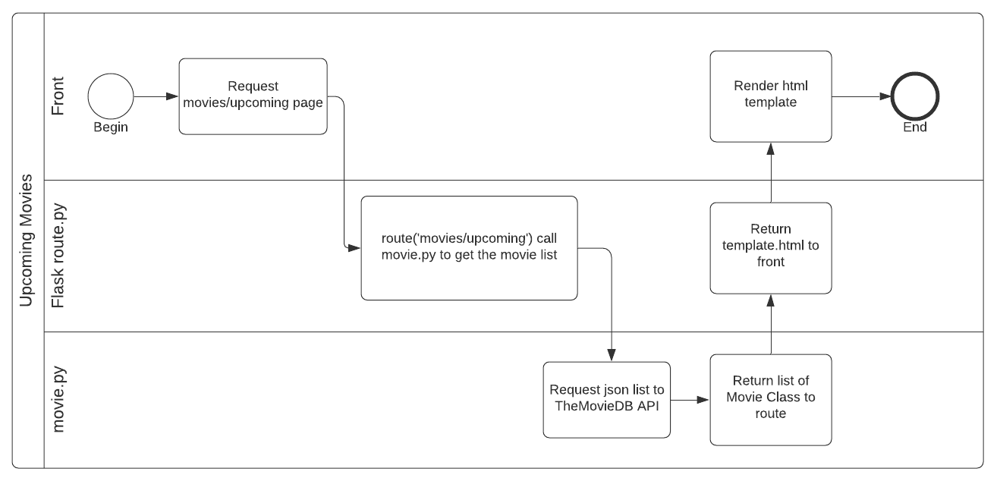

# Movies Scraping

> "Dashboard that list upcoming movies from TheMovieDB API"

### Architecture

Using Python on the backend of the application was easy to make requisitions to TheMovieDB API. The idea was to use the Requests library to create all the GET methods from a python class that works like a middleware betteween Front and API.
Also, Flask works like a MVC application with the routes and static templates without a lot of configuration like others stacks.



- Some movies does not have a image path, so I had to create a "default" image and show it instead of showing none
- I created a cache mechanism to cache each requested page for 5 minutes. Each page works like a "CacheItem" and it is insert into the "Cache" structure.

### Installation

OS X & Linux:

```sh
python get-pip.py
cd <project folder>
source venv/bin/activate
pip3 install -r requirements.txt
export FLASK_APP=main.py
flask run
```

 
### Technologies, Extensions and Libraries

- [x] Python
- [x] Flask (Microframework to web development)
- [x] Requests (Simple library to make HTTP requests)
- [x] Javascript
- [X] Jquery
- [X] Bulma.io (Modern, simple and different CSS Framework)
- [X] Heroku (To deploy application)

### Authors:
  - [vinicius1209](http://www.viniciusmachado.com/)
